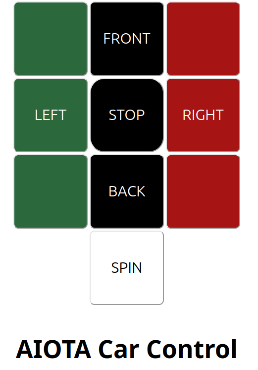
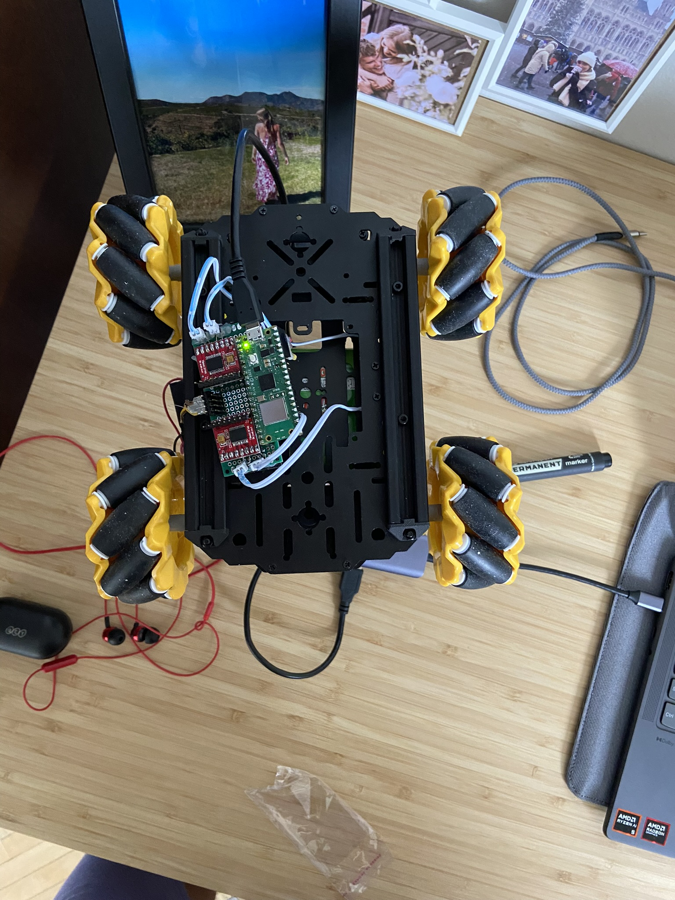

# Mecanum Car
The project was carried out as part of the AIoTa AGH scientific club. \
Author: [@martowicz](https://github.com/martowicz/)

Microcontroler: Raspberry Pi Pico W

The car connects via Wi-Fi and is controlled via the website.

## How to use

First clone the repository:
```
git clone https://github.com/martowicz/mecanum_car.git
```
Open `mecanum_car.py` and enter your WiFi details:
```
ssid='' #ENTER YOUR WIFI SSID
password='' #ENTER YOUR WIFI PASSWORD
```
Upload the code into Pi Pico and run. If connected terminal should return IP address from which you can control the car.




